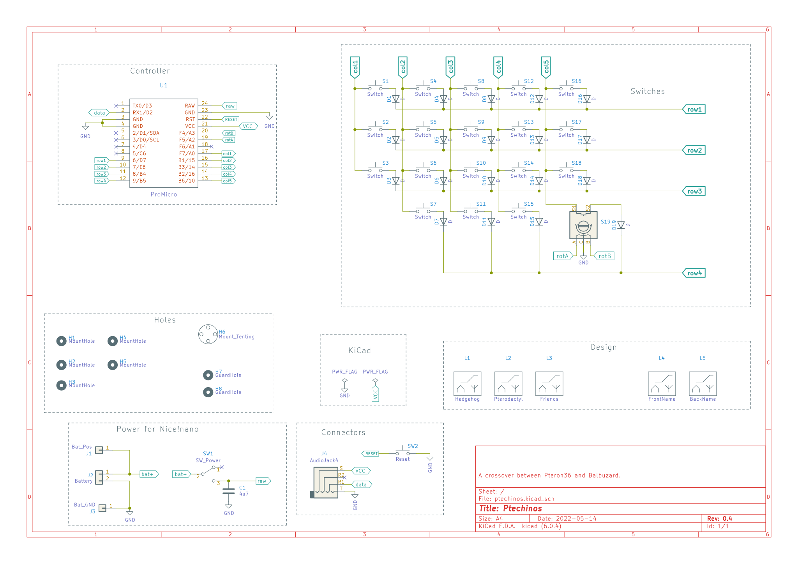

# Ptechinos

## Description
A crossover between Pteron36 and Balbuzard with 36 keys (kailh choc v1).
  - 2 optional encoders (EVQWGD001) or keys
  - 3 thumbs keys
  - 5x3 keys layout
  - Outer columns for top pinky (reduce hand torsion)
  - Small splay to adjust to natural hand shape
  - Choc switches with MX spacing
  - 157.1 x 112.6mm

**Drawings made with love by [pandhara](https://www.artstation.com/pandhara).**

## Versions
### V0.1

  - 36 keys + 2 optional encoder (EC11)
  - Pro micro footprint
  - TRRS / TRS jack to connect both halves
  - Reset

### V0.2

  - Add bluetooth components
    - On/off switch
    - Capacitor
    - Battery support
      - JST female to avoid to solder the battery
      - pins also available if soldering is needed/wanted
  - Mounting
    - Add Mounting holes (draft)
    - Add plates (draft)

### V0.3

  - Replace vertical encoder (EC11) with horizontal one (EVQWGD001)
  - Better tracing
  - Add teardrops
  - Mounting
    - Correct mounting holes size
    - Add MCU guard holes
    - Complete plates (top / bottom)
  - Add logo to silkcreen (draft)
  - Find keyboard name

### V0.4

  - Update Readme
    - Add credits
    - Add pictures
    - Add notes for available mask colors
  - Update silkscreen drawings with final version
  - Consistent hole size in switch footprints
  - Generate STL files for plate mounting
  - Make encoder (EVQWGD001) footprint reversible using SMD jumpers
    - Require to bridge jumpers on the same side as the encoder

## Notes

PCB/Solder Mask Colors :
  - yellow : `#F6A624`
  - black : `#000000`
  - white : `#ECECDF`
  - green : `#008C4A`
  - blue : `#4990E2`
  - red : `#D0011B`

